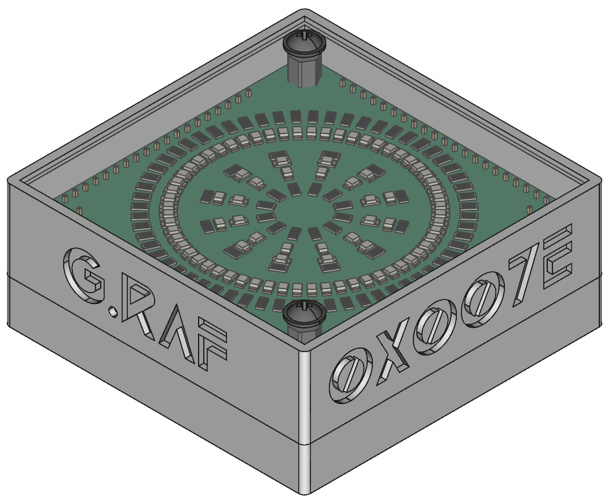
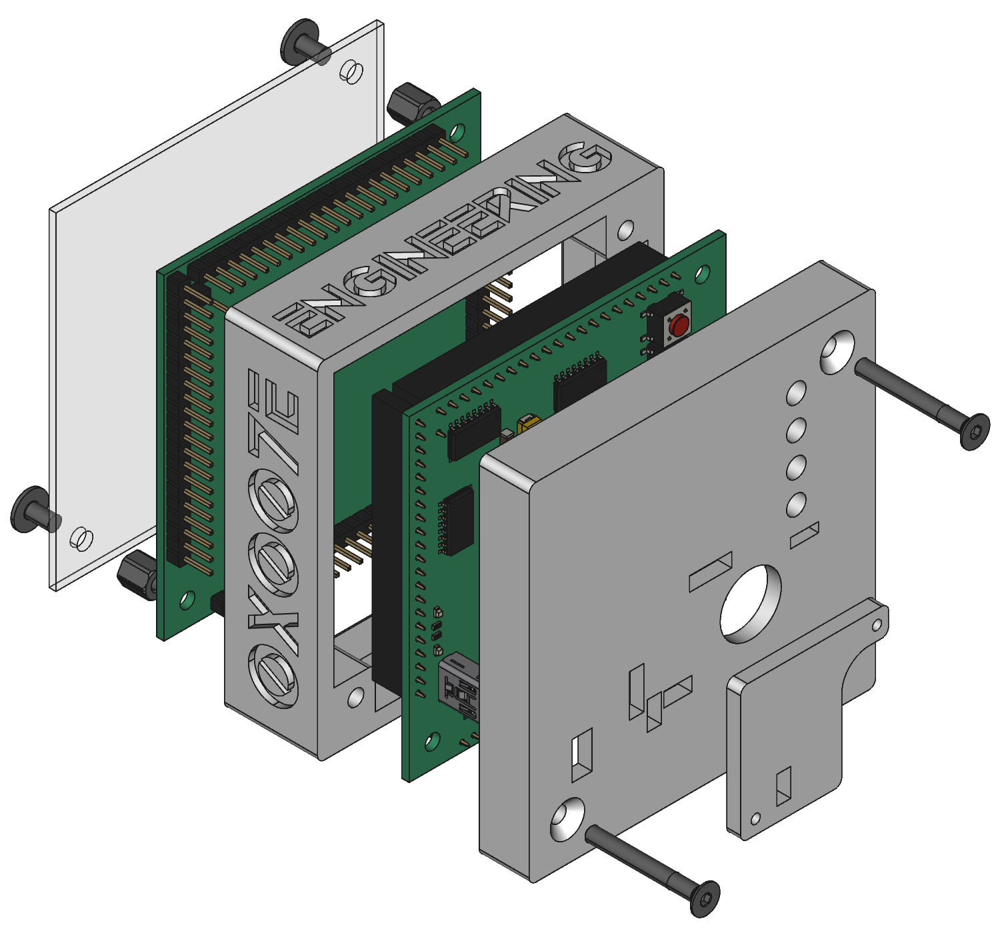

   

# `DIAC` - Digital (Analog) Clock

The `DIAC` is a digital controlled clock with `88` controllable `LEDs` over shiftregisters. 84 LEDs are used to display time/date and 4 LEDs are for signaling the current status of the clock. There is an RTC `MCP7940` for managing the time of accurately. For acoustic signalization, there is a `buzzer` on board. The core of the clocks is built by an `ATTiny1606`. The clock can be extended over an external/analog-pin. `Powering` the clock can be granted through `USB` or an `external Supply` (`5V` - `9V`). The input voltage is line regulated to 3V3. The `configuration` of the clock can be done through a `Terminal` or with the push-buttons on the backside of the clock.

# Downloads

| Type      | File               | Description              |
|:---------:|:------------------:|:-------------------------|
| Schematic | [pdf](https://github.com/sunriax/diac/releases/latest/pcb.pdf)/[cadlab](https://cadlab.io/project/28034/main/files)     | Schematic files          |
| Board     | [pdf](https://github.com/sunriax/diac/releases/latest/pcb.pdf)/[cadlab](https://cadlab.io/project/28034/main/files)     | Board file               |
| Gerber    | [zip](https://github.com/sunriax/diac/releases/latest/gerber.zip)                | Gerber/Drill files       |
| Housing   | [step/stl (zip)](https://github.com/sunriax/diac/releases/latest/mechanical.zip) | Housing (STEP) files     |
| Firmware  | [zip](https://github.com/sunriax/diac/releases/latest/firmware.zip)                | Firmware for Tiny1606    |

# Hardware

There are two parts of the hardware. The pcb and the housing of the `DIAC`. The pcb is created with  `KiCAD` and the housing with `FreeCAD`. All files are build with `github actions` so that they are ready for a production environment. The housing is printed with a 3D-printer (`Dremel 3D40`).

## PCB

The circuit board is populated on both sides. The best way for soldering is within a vapor phase soldering system.

### Top Layer

### Bottom Layer

## Mechanical

The housing has a tolerance of `0.2mm` on each side of the case. So the pcb should fit perfectly in the housing. The tolerance can be modified with `FreeCAD` in the `setup` Spreadsheet.

| Assembled | Exploded |
|:---------:|:--------:|
|  |  |

# Programming

The Firmware of the `DIAC` can be programmed over UPDI. With a simple Adapter and a USB/UART bridge (e.g. `FT232`) the DIAC can be programmed with `avrdude` and `serialupdi`. Details of the adapter can be found [here](https://github.com/0x007E/updi).

# Configuration

The `DIAC` can be configured throug `UART` or integrated `push-buttons` on the back side. The configuration throug UART is guided through a menu.

# Additional Information

| Type       | Link               | Description              |
|:----------:|:------------------:|:-------------------------|
| ATTiny1606 | [pdf](http://ww1.microchip.com/downloads/en/DeviceDoc/ATtiny806_1606_Data_Sheet_40002029A.pdf) | Microcontroller datasheet                |
| MCP7940    | [pdf](https://ww1.microchip.com/downloads/en/DeviceDoc/25010A.pdf)                    | RTC (over `I2C`) datasheet |
| Crystal    | [pdf](https://www.ndk.com/images/products/catalog/c_NX3215SA_e.pdf)                 | Datasheet |
| Crystal    | [pdf](https://www.digikey.at/Site/Global/Layouts/DownloadPdf.ashx?pdfUrl=88A25A854C314805AF4021278090528D)                | Basic information sheet |
| Font       | [html](https://www.dafont.com/black-future.font)                             | Black Future Font |

---

R. GAECHTER
